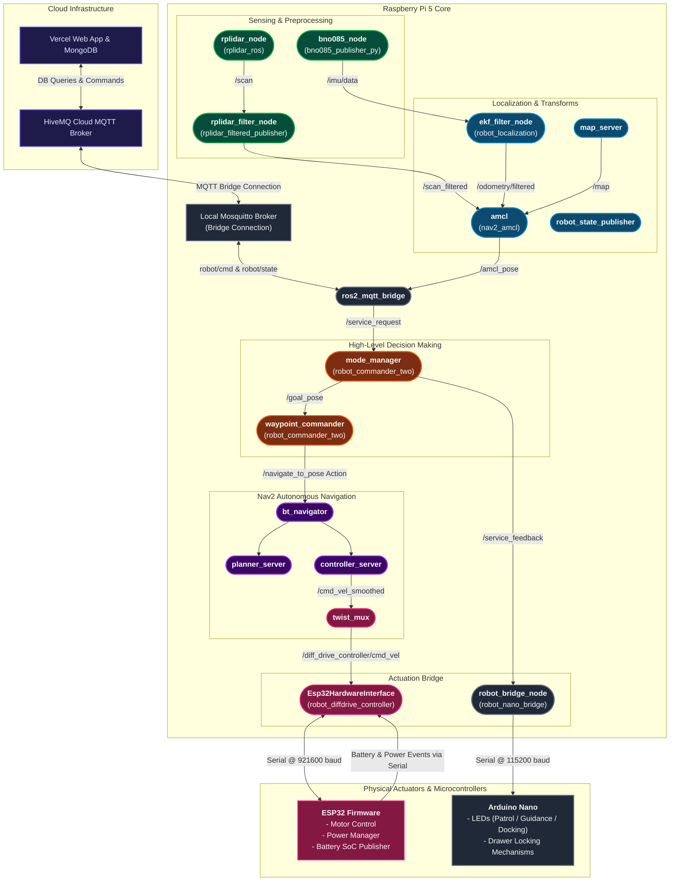
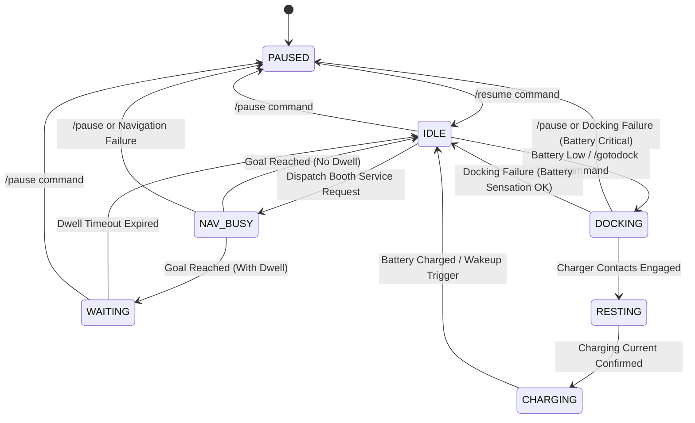

# Indoor Exhibition Delivery Robot

This workspace contains the complete ROS2 and MQTT-integrated software stack for an autonomous indoor exhibition robot. The robot is designed to navigate dynamically through exhibition booths, delivering food, water, posters, and other materials to visitors. 

---

## 📊 System Architecture

The robot features a cloud-to-device hybrid architecture. High-level commands and booth destinations are selected by users via a web portal, which propagates down to the physical wheel actuators and peripheral controllers.



---

## ⚙️ Robot Specifications

### Physical & Actuation
*   **Dimensions**: Base chassis length of $44.0\text{ cm}$, width of $50.0\text{ cm}$, and height of $10.0\text{ cm}$.
*   **Drive Type**: Differential drive with two active wheels and two passive caster wheels at the front/sides.
*   **Wheel Dimensions**: Wheel radius of $3.3\text{ cm}$ and wheel separation of $29.0\text{ cm}$.
*   **Velocity Limits**: Configured in ROS2 Control system boundaries between $[-9.0, 9.0]\text{ rad/s}$ motor speed.

### Onboard Sensors
*   **IMU (BNO085)**: Connected over I2C to the Raspberry Pi 5. Provides high-rate fused orientations, angular velocities, and gravity-compensated linear accelerations. Published on `/imu/data` for EKF fusion.
*   **LiDAR (RPLidar A1M8)**: Mounted forward-center and physically rotated 180 degrees (`yaw = pi` in URDF). Provides 360-degree laser range scans published on `/scan`.

### Microcontroller Infrastructure
*   **ESP32 Power & Motor Manager**:
    *   Acts as the physical wheel velocity controller (receives target speeds and returns encoder readings).
    *   Exposes physical on/off buttons to control the system power.
    *   Monitors battery SoC and estimated runtime, publishing telemetry metrics directly to the local broker.
*   **Arduino Nano Auxiliary Bridge**:
    *   Drives the status indicator LED strip with modes matching FSM states (`PATROL`, `GUIDANCE`, `DOCKING`).
    *   Drives physical drawer mechanisms (locks, unlocks, and monitors jams).

---

## 🌐 Network & Communications Topology

The system separates high-bandwidth local robot control traffic from cloud-facing control commands through a multi-network configuration on the Raspberry Pi 5.

```
                  ┌──────────────────────────────────────────────┐
                  │                Raspberry Pi 5                │
                  │  ┌───────────┐         ┌──────────────────┐  │
                  │  │   wlan0   │────────▶│ Upstream Hotspot │  │  (STA - Internet)
                  │  │ (172.x.x) │         │ (WiFi Router/S20)│  │
                  │  └───────────┘         └──────────────────┘  │
                  │        ▲                                     │
                  │        │ NAT / IP Forwarding                 │
                  │        ▼                                     │
                  │  ┌───────────┐         ┌──────────────────┐  │
                  │  │   uap0    │◀────────│  Local Devices   │  │  (AP - PiLocalNet)
                  │  │192.168.4.1│         │  (192.168.4.x)   │  │  (ESP32, Nano, etc.)
                  │  └───────────┘         └──────────────────┘  │
                  └──────────────────────────────────────────────┘
```

*   **AP Mode (`uap0`)**: Creates a local wireless access point named `PiLocalNet` (running on 192.168.4.1 via `hostapd`). It serves DHCP leases to the ESP32 and other local peripherals using `dnsmasq`. Power save is disabled to prevent latency spikes.
*   **STA Mode (`wlan0`)**: Connects to an upstream WiFi network (e.g., a phone hotspot or building router) for internet access.
*   **NAT & IP Forwarding**: Enabled on the Pi 5 to route packets between the local subnet (`uap0`) and the external internet (`wlan0`).
*   **MQTT Bridge Configuration**:
    *   The Pi 5 runs a local Mosquitto MQTT broker on `localhost:1883`.
    *   It maintains an active bridge connection configured to sync `robot/#` topics with HiveMQ.
    *   This ensures local telemetry is published to the cloud and command topics are received even in intermittent internet connectivity conditions. Message persistence handles buffer logs when offline.

---

## 🤖 State Machine & Robot Behavior

The robot’s high-level workflow is managed by the C++ `mode_manager` node implementing a Finite State Machine (FSM).



### State-to-Peripheral Behaviors

| FSM State | legacy /robot_state | Nano LED Mode | Nano Drawer Behavior | Description / Triggers |
| :--- | :--- | :--- | :--- | :--- |
| **PAUSED** | `PAUSED` | `OFF` (Red safe-state) | Closed / Static | Emergency pause or operators halting navigation. |
| **IDLE** | `IDLE` | `PATROL` (Green/Cyan) | Closed / Static | Waiting in queue for service request or patrolling. |
| **NAV_BUSY** | `EXECUTING` | `GUIDANCE` (Animated) | Closed / Locked | Robot is actively navigating to a selected booth. |
| **WAITING** | `WAITING` | `PATROL` (Green/Cyan) | Opened | Reached destination. The drawer opens for cargo removal. |
| **DOCKING** | `DOCKING` | `DOCKING` (Amber pulses) | Closed / Locked | Moving to charger. Initiated on battery < 20% or `/gotodock`. |
| **RESTING** | `RESTING` | `DOCKING` | Closed / Locked | Reached charging station contacts. |
| **CHARGING**| `CHARGING` | `DOCKING` | Closed / Locked | Charger engaged. Battery charging monitored. |

---

## 📦 Software Package Registry

The workspace `/src` directory consists of the following packages:

### 1. [bno085_publisher_py](file:///wsl.localhost/Ubuntu/home/nguye/ros2_project_ws/src/bno085_publisher_py)
Python driver package for the BNO085 IMU. Reads reports over I2C and publishes on `/imu/data` (QoS profile matched for EKF fusion).

### 2. [rplidar_filtered_publisher](file:///wsl.localhost/Ubuntu/home/nguye/ros2_project_ws/src/rplidar_filtered_publisher)
C++ node `rplidar_filter_node` which subscribes to raw `/scan` data, applies a mask to filter out laser beams hitting structural robot pillars (preventing self-collision detection), and publishes the filtered data on `/scan_filtered`.

### 3. [my_robot_description](file:///wsl.localhost/Ubuntu/home/nguye/ros2_project_ws/src/my_robot_description)
Contains the robot's URDF model (`robot.urdf.xacro`) detailing links, caster and wheel joints, frames for LiDAR and IMU, and configuration properties for `ros2_control` bindings.

### 4. [my_robot_bringup](file:///wsl.localhost/Ubuntu/home/nguye/ros2_project_ws/src/my_robot_bringup)
A launch orchestration package featuring:
*   Launch scripts (`localization.launch.py`, `navigation.launch.py`, `slam.launch.py`, `cartographer.launch.py`).
*   Configuration parameter files (Nav2 YAML, EKF EKF filter parameters, twist_mux overrides, slam_toolbox specs).
*   The `robot_manager.py` boot daemon script.

### 5. [robot_commander_two](file:///wsl.localhost/Ubuntu/home/nguye/ros2_project_ws/src/robot_commander_two)
The high-level coordination package containing the custom message definition `ServiceRequest.msg`.
*   `mode_manager.cpp`: Implements the global FSM, coordinates task priorities (1=LOW to 255=CRITICAL), and handles battery low auto-preemption.
*   `wp_commander.cpp`: Feeds coordinates from the `mode_manager` to the `/navigate_to_pose` Nav2 Action client.

### 6. [robot_diffdrive_controller](file:///wsl.localhost/Ubuntu/home/nguye/ros2_project_ws/src/robot_diffdrive_controller)
Exposes the C++ hardware system interface `Esp32HardwareInterface`. Loaded into the ROS2 control manager, it coordinates communication with the physical ESP32 driving motor controllers using serialized velocity commands.

### 7. [ros2_mqtt_bridge](file:///wsl.localhost/Ubuntu/home/nguye/ros2_project_ws/src/ros2_mqtt_bridge)
Bridges communication between local ROS2 topics and the local Mosquitto MQTT broker.
*   Translates incoming MQTT booth goals into `ServiceRequest` messages.
*   Exposes FSM state updates, `amcl_pose`, battery levels, and powerswitch statuses to MQTT telemetry.

### 8. [robot_nano_bridge](file:///wsl.localhost/Ubuntu/home/nguye/ros2_project_ws/src/robot_nano_bridge)
Bridges status and feedback updates to the Arduino Nano. Contains `state_translator.py` which decodes ROS2 `service_feedback` JSON arrays and commands LEDs and drawer locking mechanisms via serial.

---

## 🚀 Startup & Execution Workflow

On boot, the systemd unit `robot_manager.service` launches the `robot_manager.py` coordinator. The coordinator spins up the software stack sequentially:

1.  **Stage 1: Localization**
    *   Launches `localization.launch.py` (starts IMU node, LiDAR node, LiDAR filter node, `robot_state_publisher`, `joint_state_broadcaster`, and the `ekf_filter_node`).
    *   *Readiness Check*: Blocks until the `/odometry/filtered` topic is actively publishing.
2.  **Stage 2: Navigation**
    *   Launches `navigation.launch.py` (starts Nav2 stack, costmaps, planner, controllers, recovery behaviors, and `twist_mux`).
    *   *Readiness Check*: Blocks until the `/navigate_to_pose` Action server becomes available.
3.  **Stage 3: MQTT Bridge**
    *   Launches `ros2_mqtt_bridge`.
    *   *Readiness Check*: 3-second initialization delay.
4.  **Stage 4: Robot Commander**
    *   Launches `robot_commander_two` nodes (`mode_manager`, `waypoint_commander`).
    *   *Readiness Check*: 2-second stabilization delay.
5.  **Stage 5: Nano Bridge**
    *   Launches the `robot_nano_bridge_node`.
    *   *Readiness Check*: 2-second delay while serial locks onto the Arduino Nano interface.

Once all stages are verified online, the `robot_manager` publishes `"ready"` to the MQTT status topic `robot/pi/status` and begins emitting a status heartbeat.
