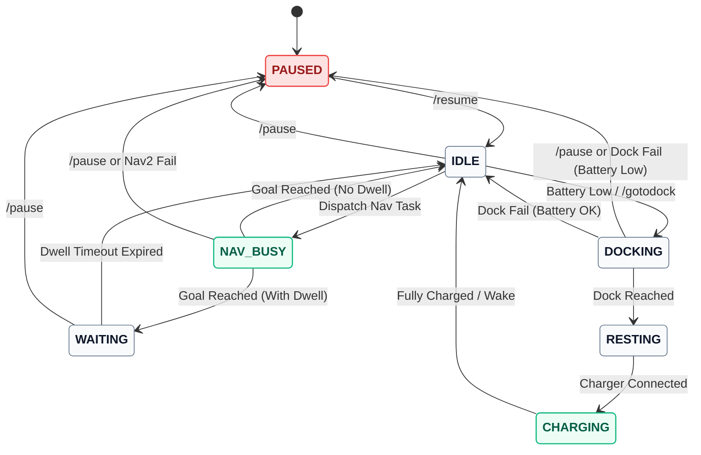

# Robot State Machine (Mermaid.js)

Below is the Mermaid.js state diagram syntax representing how the `mode_manager` handles the robot's states. You can preview this directly in Markdown editors (like Obsidian, VS Code, or Notion) or copy the code block and paste it into [mermaid.live](https://mermaid.live/) to export it as an image.

