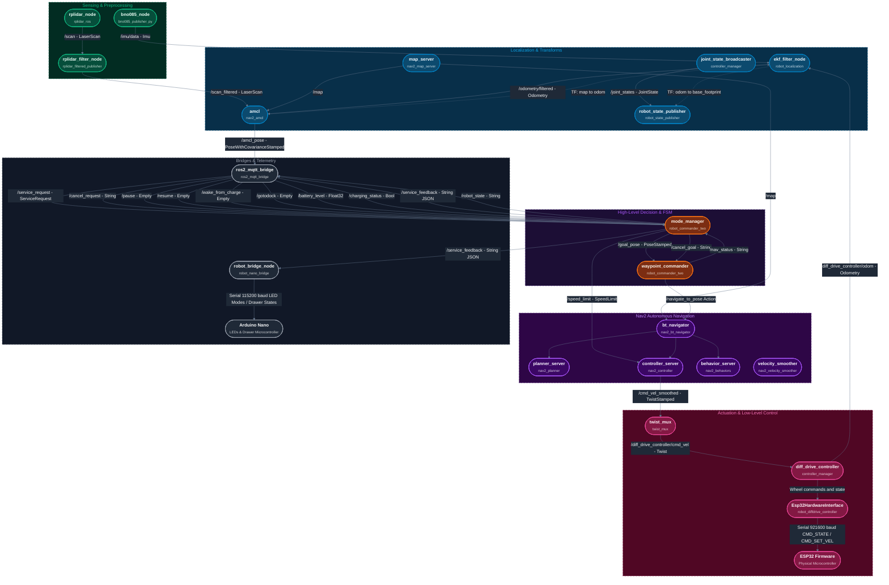

# ROS2 Node Interaction Architecture

This document describes the node interaction architecture of your ROS2 project, excluding `imu_tof_publisher` and `camera_fusion`. 

---

## 📊 Node Interaction Diagram

Below is a highly stylized, dark-mode-optimized dynamic flowchart mapping the flow of data across the entire robot stack. Nodes are logically grouped by their subsystem boundary.

---

## ⚙️ Detailed Node Directory & Interface Registry

Below is a detailed breakdown of all ROS2 nodes, standard and custom, active in your system workspace.

### 1. High-Level Coordination & FSM (`robot_commander_two`)

#### 🟣 `mode_manager`
* **Role**: The central FSM orchestrating high-level robot states (`PAUSED`, `IDLE`, `WAITING`, `NAV_BUSY`, `DOCKING`, `RESTING`, `CHARGING`). Integrates task priorities, queueing, emergency docking on low battery, and operator pause/resume interventions.
* **Subscriptions**:
  * `service_request` (`robot_commander_two/msg/ServiceRequest`): Incoming job requests.
  * `nav_status` (`std_msgs/msg/String`): Completeness feedback (`RUNNING`, `SUCCEEDED`, `FAILED`, `CANCELED`, `NAV_UNAVAILABLE`) from `waypoint_commander`.
  * `cancel_request` (`std_msgs/msg/String`): Cancels a specific `command_id` or `*` for all.
  * `pause` (`std_msgs/msg/Empty`): Pauses currently running actions.
  * `resume` (`std_msgs/msg/Empty`): Resumes queued actions.
  * `battery_level` (`std_msgs/msg/Float32`): Monitored for emergency auto-docking (threshold: 20%).
  * `wake_from_charge` (`std_msgs/msg/Empty`): Forces robot out of charging status.
  * `charging_status` (`std_msgs/msg/Bool`): Input from powerswitch confirming contact.
  * `gotodock` (`std_msgs/msg/Empty`): Manual trigger to command immediate docking.
* **Publications**:
  * `goal_pose` (`geometry_msgs/msg/PoseStamped`): Dispatched to `waypoint_commander`.
  * `cancel_goal` (`std_msgs/msg/String`): Sends `"CANCEL"` to interrupt active waypoints.
  * `service_feedback` (`std_msgs/msg/String` JSON): JSON task updates (`ACCEPTED`, `REJECTED`, `QUEUED_WHILE_PAUSED`, `EXECUTING`, `CANCELING`, `SUCCEEDED`, `FAILED`, `CANCELED`, `PREEMPTED`, `PREEMPTED_BY_DOCK`).
  * `robot_state` (`std_msgs/msg/String`): High-level system state derived from FSM.
  * `speed_limit` (`nav2_msgs/msg/SpeedLimit`): Sends task-specific speed limits (e.g. `0.3 m/s` during patrol).

#### 🟣 `waypoint_commander`
* **Role**: Translates simple ROS2 topic goals into robust Nav2 Action calls. Solves race conditions, manages stale results, and handles graceful cancels.
* **Subscriptions**:
  * `goal_pose` (`geometry_msgs/msg/PoseStamped`): Targets sent by `mode_manager`.
  * `cancel_goal` (`std_msgs/msg/String`): Listens for `"CANCEL"` to abort navigation.
* **Publications**:
  * `nav_status` (`std_msgs/msg/String`): Publishes status updates back to `mode_manager`.
* **Action Interfaces**:
  * Exposes an Action Client to the `/navigate_to_pose` Action Server (served by `bt_navigator`).

---

### 2. Sensing & Preprocessing

#### 🟢 `bno085_node` (`bno085_publisher_py`)
* **Role**: Interfaces with the onboard BNO085 IMU over I2C on the Pi 5. Configures feature reports and publishes high-rate fusion metrics.
* **Publications**:
  * `/imu/data` (`sensor_msgs/msg/Imu`): Clean fusion quaternion, angular velocities, and linear accelerations (gravity-compensated).
  * `/imu/mag` (`sensor_msgs/msg/MagneticField`): Corrected magnetic readings.
  * `/imu/temp` (`sensor_msgs/msg/Temperature`): Sensor temperature.
  * Optionally broadcasts static frame TF transform between `base_link` and `imu_link`.

#### 🟢 `rplidar_node` (`rplidar_ros`)
* **Role**: Driver node for the RPLidar physical sensor.
* **Publications**:
  * `/scan` (`sensor_msgs/msg/LaserScan`): Raw 360-degree range array.

#### 🟢 `rplidar_filter_node` (`rplidar_filtered_publisher`)
* **Role**: Subscribes to the raw LIDAR scan and filters out data within a configurable blind-spot angular window (e.g., to ignore internal structural shadows of the robot frame).
* **Subscriptions**:
  * `/scan` (`sensor_msgs/msg/LaserScan`)
* **Publications**:
  * `/scan_filtered` (`sensor_msgs/msg/LaserScan`): Clean scan containing quiet `NaN`s in blind angles.

---

### 3. Localization & Odometry Estimation

#### 🔵 `ekf_filter_node` (`robot_localization`)
* **Role**: Integrates high-rate sensor streams (wheels + gyro/accel) using an Extended Kalman Filter to estimate a smooth, continuous 2D position.
* **Subscriptions**:
  * `odom0` remapped to `/diff_drive_controller/odom` (consumes linear speed `vx` and yaw rate `vyaw`).
  * `imu0` remapped to `/imu/data` (consumes orientation `roll, pitch, yaw` and angular velocity `vroll, vpitch, vyaw`).
* **Publications**:
  * `/odometry/filtered` (`nav_msgs/msg/Odometry`): Fused state.
  * **Transforms**: Broadcasts the dynamic transform `odom ➔ base_footprint`.

#### 🔵 `amcl` (`nav2_amcl`)
* **Role**: Adaptive Monte Carlo Localization node. Matches filtered LIDAR scans against the static map to calculate global robot position.
* **Subscriptions**:
  * `/scan_filtered` (`sensor_msgs/msg/LaserScan`)
  * `/map` (`nav_msgs/msg/OccupancyGrid`)
  * Transform Tree (`/tf`, `/tf_static`)
* **Publications**:
  * `/amcl_pose` (`geometry_msgs/msg/PoseWithCovarianceStamped`): Global localized pose.
  * **Transforms**: Broadcasts the dynamic coordinate map correction transform `map ➔ odom`.

---

### 4. Bridges & Interface Layers

#### 🔘 `ros2_mqtt_bridge`
* **Role**: Relays state telemetry out to external MQTT brokers and parses incoming remote JSON commands into native ROS2 messages.
* **ROS2 Subscriptions**:
  * `amcl_pose` (`geometry_msgs/msg/PoseWithCovarianceStamped`): Relayed to MQTT `robot/state/pose` (as JSON position and yaw).
  * `service_feedback` (`std_msgs/msg/String` JSON): Relayed to MQTT `robot/state/service_feedback`.
  * `robot_state` (`std_msgs/msg/String`): Relayed to MQTT `robot/state/state`.
* **ROS2 Publications**:
  * `service_request` (`robot_commander_two/msg/ServiceRequest`): Relayed from MQTT `robot/cmd/service_request`.
  * `cancel_request` (`std_msgs/msg/String`): Relayed from MQTT `robot/cmd/cancel_request`.
  * `wake_from_charge` (`std_msgs/msg/Empty`): Relayed from MQTT `robot/cmd/wakeup`.
  * `pause` (`std_msgs/msg/Empty`): Relayed from MQTT `robot/cmd/pause`.
  * `resume` (`std_msgs/msg/Empty`): Relayed from MQTT `robot/cmd/resume`.
  * `gotodock` (`std_msgs/msg/Empty`): Relayed from MQTT `robot/cmd/gotodock`.
  * `battery_level` (`std_msgs/msg/Float32`): Relayed from MQTT `robot/battery/status` (`soc` field).
  * `charging_status` (`std_msgs/msg/Bool`): Relayed from MQTT `robot/powerswitch/event` (charger plugged / unplugged event).

#### 🔘 `robot_bridge_node` (`robot_nano_bridge`)
* **Role**: Subscribes to the robot status and maps the lifecycle progress to an Arduino Nano controlling physical hardware (like status LEDs and drawer locking mechanisms).
* **Subscriptions**:
  * `service_feedback` (`std_msgs/msg/String` JSON): Handled via `StateTranslator` to resolve appropriate LED pattern commands.
* **External I/O**:
  * Serial connection (`/NANO_hub.2` at 115200 baud) running a robust protocol with retry/reconnect loops.

---

### 5. Actuation & Low-Level Control

#### 💗 `twist_mux`
* **Role**: Collects velocity inputs from multiple command sources (e.g. autonomous navigation, manual teleoperation, safety bumpers) and outputs the highest priority command.
* **Subscriptions**:
  * `cmd_vel_smoothed` (`geometry_msgs/msg/TwistStamped`, Priority 10): Output of Nav2.
  * `cmd_vel_safe` (`geometry_msgs/msg/TwistStamped`, Priority 100): Safety override topic.
  * `diff_drive_teleop/cmd_vel` (`geometry_msgs/msg/TwistStamped`, Priority 100): Keyboard override topic.
* **Publications**:
  * `cmd_vel_out` remapped to `/diff_drive_controller/cmd_vel` (`geometry_msgs/msg/Twist`).

#### 💗 `diff_drive_controller` (`controller_manager`)
* **Role**: A standard ROS2 Control controller that converts linear and angular robot velocities into corresponding wheel velocities, integrates encoders, and publishes wheel odometry.
* **Subscriptions**:
  * `/diff_drive_controller/cmd_vel` (`geometry_msgs/msg/Twist`)
* **Publications**:
  * `diff_drive_controller/odom` (`nav_msgs/msg/Odometry`)
  * `/joint_states` (`sensor_msgs/msg/JointState`): Individual wheel angles and velocities.
* **Hardware Interface**:
  * Binds to the custom C++ plugin `Esp32HardwareInterface` system.

#### 💗 `Esp32HardwareInterface` (`robot_diffdrive_controller`)
* **Role**: Dynamic `hardware_interface::SystemInterface` plugin loaded into the main control loop.
* **External I/O**:
  * Communicates with the physical ESP32 driving motor controllers via high-speed Serial (`921600` baud) using a structured packet format (`CMD_STATE` and `CMD_SET_VEL`).

---

## 🔄 End-to-End Data Flow Scenarios

### Scenario A: Dispatching an Autonomous Mission
1. **Trigger**: An operator dispatches a task via MQTT topic `robot/cmd/service_request` with JSON coordinates `(x, y, yaw)` and metadata.
2. **Bridge**: `ros2_mqtt_bridge` parses the payload, constructs a `PoseStamped` message, wraps it inside a `robot_commander_two/msg/ServiceRequest`, and publishes to `/service_request`.
3. **Coordination**: `mode_manager` validates the task and pushes it onto its priority queue. Being `IDLE`, it immediately dispatches the task by publishing a speed limit to `/speed_limit` and coordinates to `/goal_pose`.
4. **Action**: `waypoint_commander` receives `/goal_pose`, verifies action server availability, and calls the `/navigate_to_pose` action hosted by Nav2.
5. **Path Planning & Smoothing**: `bt_navigator` coordinates the Nav2 stack. `planner_server` builds a path, and `controller_server` computes dynamic velocities respecting the speed limit. The output is smoothed by `velocity_smoother` and sent on `/cmd_vel_smoothed`.
6. **Actuation**: `twist_mux` receives the smoothed command, prioritizes it, and sends it to `/diff_drive_controller/cmd_vel`. `diff_drive_controller` calculates individual wheel velocities, which `Esp32HardwareInterface` streams to the ESP32 to drive the motors.
7. **Feedback**: `robot_bridge_node` receives the JSON `/service_feedback` (`EXECUTING`) and signals the Arduino Nano via serial to transition its status LEDs into the **Guidance** mode.

### Scenario B: Low Battery & Emergency Docking
1. **Trigger**: Battery level drops below 20%. The ESP32 sends a status telemetry frame over serial, which eventually reaches MQTT.
2. **Bridge**: `ros2_mqtt_bridge` converts this and publishes a float payload to `/battery_level`.
3. **Coordination**: `mode_manager` catches the low battery level. It cancels the active goal, preempts the queue, and initiates docking. It generates an emergency dock task (`DOCK_AUTO_X`) at the preconfigured dock coordinates, sending it to `/goal_pose`.
4. **Bridge Feedback**: `mode_manager` publishes `/service_feedback` with status `PREEMPTED_BY_DOCK`. The `robot_bridge_node` immediately instructs the Arduino Nano to switch LEDs into **Docking** mode.
5. **Navigation**: Nav2 guides the robot toward the dock station.
6. **Contact**: The robot touches the charging dock contacts. The powerswitch broadcasts a `"charger_connected"` MQTT event.
7. **Docking Complete**: `ros2_mqtt_bridge` converts the event and publishes `/charging_status` as `True`. `mode_manager` detects this contact, cancels any remaining active movement, transitions its global FSM into `CHARGING`, and suspends the dispatcher queue.
